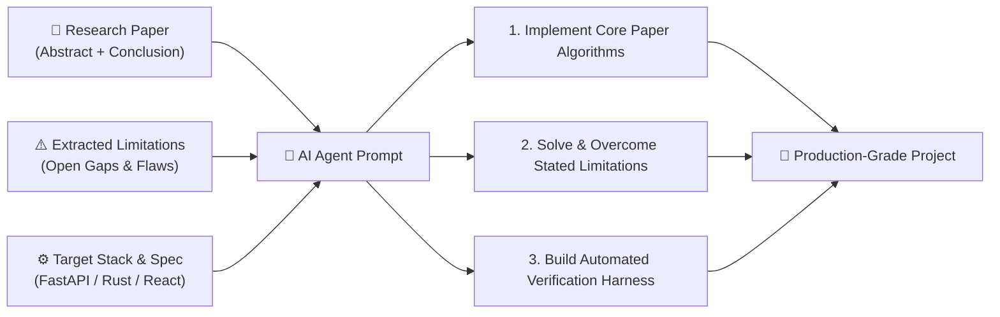

# ArXiv Project Finder & AI Agent Prompt Studio

An intelligent research-to-code exploration platform and multi-agent project formulation engine. It indexes research papers from arXiv (AI, Cybersecurity, and Cross-domain intersections), automatically extracts core abstracts, conclusions, and explicit limitations/future work, and transforms them into comprehensive, production-grade engineering directives for AI coding agents (**Antigravity, Claude Code, Codex, Cursor**).

Built with **FastAPI**, **SQLite**, **PyMuPDF**, and **React 19 / TypeScript / Tailwind CSS** adhering to [`@ibelick/ui-skills`](https://github.com/ibelick/ui-skills) (`baseline-ui`).

---

## 🎯 Research-to-Code Pipeline



---

## ⚡ Quick Start

### 1. Launch the Web UI & API Server
```bash
# Start backend server & dashboard on http://localhost:8000
python main.py serve

# Or with live hot-reloading
python main.py serve --reload
```
Open **[http://localhost:8000](http://localhost:8000)** in your browser to access the Web UI.

---

## 🚀 Key Features

### 1. 🔍 Research Insights Explorer
- **150+ Indexed Papers** across AI, Machine Learning, and Cybersecurity domains.
- **Deep Extraction Pipeline**: Automatically parses paper conclusions and cited limitations from local PDFs (via PyMuPDF) and arXiv HTML fallbacks.
- **Search & Filters**: Instant keyword search across abstracts, authors, conclusions, and limitations, plus quick filters for "Has Limitations" and "Starred".
- **Built-in Local PDF Viewer**: Open and read cached PDFs in an embedded reader tab or full browser tab without re-downloading.

### 2. 🤖 AI Agent Prompt Studio
- Turn any research paper's findings and limitations into ready-to-execute software project prompts.
- **Agent Targets**:
  - **Antigravity**: Formulates planning mode directives, domain models, ADR proposals, milestone roadmaps, and verification test harnesses.
  - **Claude Code**: Generates concise, execution-oriented prompts with TDD constraints, atomic file scaffolding, and `CLAUDE.md` guidelines.
  - **Codex / OpenAI**: Generates formal `SPEC.md` and schema contracts.
  - **Cursor / Windsurf**: Generates `.cursorrules` and rapid scaffolding directives.
- **Multi-Paper Synthesis**: Select multiple complementary research papers to synthesize hybrid system architectures.
- **One-Click Actions**: Copy prompt for your AI agent or download `PROMPT.md` / `SPEC.md`.

### 3. 📡 Live arXiv Scraper & Ingestion Console
- Real-time ingestion interface with preset query suites and custom search queries.
- Live streaming log terminal tracking arXiv API queries, PDF downloads, and extraction progress.

### 4. 📊 Limitation Taxonomy Analytics
- Aggregate analysis of common research bottlenecks:
  - *Transferability & Generalization Gaps*
  - *Computational Overhead & Latency*
  - *Adaptive Adversaries & Evasion*
  - *Dataset Bias & Benchmark Limitations*
  - *Policy & Governance Specification*

---

## 💻 CLI Commands

In addition to the Web UI, `main.py` provides rich CLI subcommands:

### 1. Generate an AI Agent Prompt from CLI
```bash
python main.py prompt --paper-ids 2606.12320v1 --agent antigravity --stack python_fastapi_react --output PROMPT.md
```

### 2. View Research Analytics
```bash
python main.py stats
```

### 3. Sync Legacy Markdown Papers into Database
```bash
python main.py sync
```

---

## 🛠️ Tech Stack & Architecture

- **Backend**: Python 3.14, FastAPI, SQLite, Pydantic v2, PyMuPDF (`fitz`), arXiv API client, BeautifulSoup4.
- **Frontend**: React 19, TypeScript, Vite, Tailwind CSS v4, Lucide Icons, `clsx` + `tailwind-merge`.
- **UI System**: Clean, dense, accessible UI built under `@ibelick/ui-skills` (`baseline-ui`) constraints (no gradient slop, `tabular-nums`, structural skeletons, `text-balance` typography).

---

## 🧪 Testing

Run backend unit and integration tests:
```bash
uv run pytest
```
