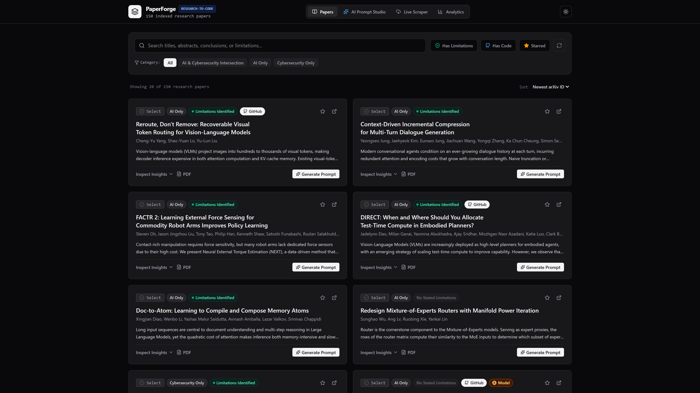
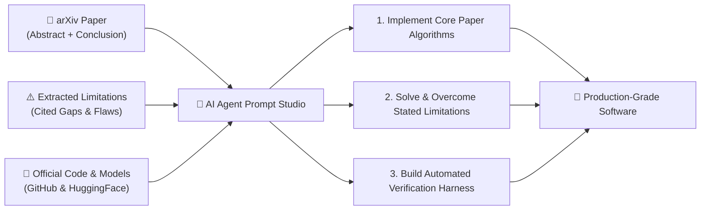
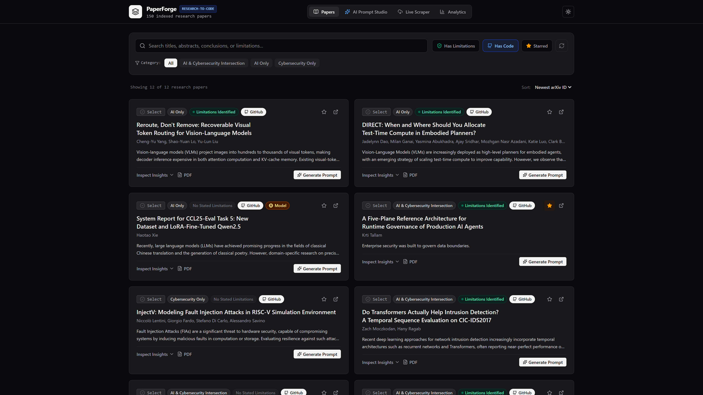
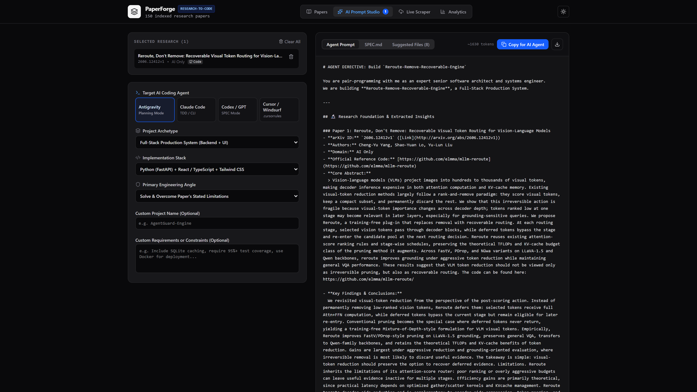
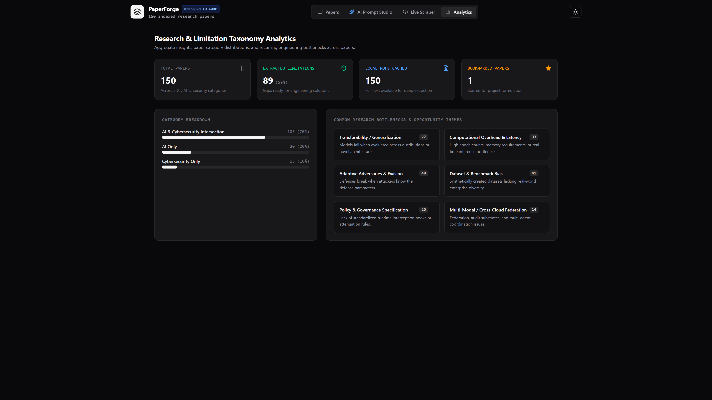

# PaperForge 🔨

> **Research-to-Code Platform & Multi-Agent Prompt Studio**  
> Turn cutting-edge arXiv research papers and their explicit limitations into production-grade software using AI coding agents (**Google Antigravity, Claude Code, OpenAI Codex, Cursor**).

[](LICENSE)
[](https://python.org)
[](https://fastapi.tiangolo.com)
[](https://react.dev)
[](https://tailwindcss.com)
[](tests/)

---



---

## 💡 The Core Premise

Most academic research papers contain an unvarnished **"Limitations & Future Work"** section where authors cite the exact bottlenecks, scalability ceilings, and failure modes they were unable to solve.

**PaperForge** indexes arXiv papers, deeply parses their conclusions and cited limitations, extracts official GitHub codebases and Hugging Face model weights, and compiles structured engineering directives for AI coding agents to implement the fix.



---

## ⚡ Quick Start

### Prerequisites
- Python 3.12+ (or [`uv`](https://docs.astral.sh/uv/))
- Node.js 20+ (optional, only if modifying the frontend)

### 1. Clone & Install
```bash
git clone https://github.com/Ciatel-Arlanta/PaperForge.git
cd PaperForge

# Install dependencies using uv (recommended)
uv sync

# Or using standard pip
pip install -r requirements.txt
```

### 2. Launch the Application
```bash
# Start backend server & embedded dashboard on http://localhost:8000
python main.py serve

# Or with live hot-reloading for development
python main.py serve --reload
```
Open **[http://localhost:8000](http://localhost:8000)** in your browser.

---

## 🎬 Launch & Demo Video

PaperForge includes a programmatically generated launch video built with **[Remotion](https://www.remotion.dev/)** and the official Remotion Agent Skills (`remotion-dev/skills`).

- **Video File**: `video/out/PaperForge_Launch.mp4` (1080p Full HD, 30 FPS, Stereo Synth Soundtrack)
- **Interactive Remotion Studio**:
  ```bash
  cd video
  npm install
  npm run dev
  ```
  Open **[http://localhost:3000](http://localhost:3000)** to scrub the timeline and adjust scenes.

---

## 🚀 Key Features & Walkthrough

### 1. 🔍 Research Insights Explorer & Code Detection
- **150+ Pre-Indexed Papers** across AI, Machine Learning, and Cybersecurity.
- **Deep Extraction Pipeline**: Automatically parses paper conclusions and cited limitations from local PDFs (via PyMuPDF) and arXiv HTML fallbacks.
- **GitHub Reference Code & Model Links**: Automatically extracts official GitHub repositories and Hugging Face model checkpoints.
- **Instant Filters**: Filter by `Has Limitations`, `Has Code`, and `Starred`.



---

### 2. 🤖 AI Agent Prompt Studio
Formulates comprehensive, battle-tested implementation prompts tailored to specific AI coding agents:
- **Google Antigravity**: Formulates planning mode directives, domain models, ADR proposals, milestone roadmaps, and verification test harnesses.
- **Claude Code**: Generates concise, execution-oriented prompts with TDD constraints, atomic file scaffolding, and `CLAUDE.md` guidelines.
- **OpenAI Codex**: Generates formal `SPEC.md` and schema contracts.
- **Cursor / Windsurf**: Generates `.cursorrules` and rapid scaffolding directives.
- **Multi-Paper Synthesis**: Select multiple complementary research papers to synthesize hybrid system architectures.



---

### 3. 📊 Limitation Taxonomy & Research Gap Analytics
Aggregate analysis of common research bottlenecks across the paper collection:
- *Transferability & Generalization Gaps*
- *Computational Overhead & Latency*
- *Adaptive Adversaries & Evasion*
- *Dataset Bias & Benchmark Limitations*
- *Policy & Governance Specification*



---

## 💻 CLI Commands

In addition to the Web UI, `main.py` provides rich CLI commands:

### 1. Generate an AI Agent Prompt from CLI
```bash
python main.py prompt --paper-ids 2606.12320v1 --agent antigravity --stack python_fastapi_react --output PROMPT.md
```

### 2. View Research Analytics
```bash
python main.py stats
```

### 3. Synchronize Papers into SQLite Database
```bash
python main.py sync
```

---

## 🛠️ Architecture & Tech Stack

```
PaperForge/
├── app/                      # FastAPI backend application
│   ├── database.py           # SQLite database & regex code extractors
│   ├── main.py               # REST API endpoints & static SPA server
│   ├── prompt_engine.py      # Multi-agent prompt compilation engine
│   ├── schemas.py            # Pydantic data contracts
│   └── scraper_service.py    # Async arXiv crawler & PyMuPDF extractor
├── assets/                   # README screenshots & architecture diagrams
├── frontend/                 # React 19 + TypeScript + Tailwind CSS v4 SPA
│   └── src/
│       ├── components/       # UI components (Header, PaperCard, PromptStudio, Modal)
│       └── App.tsx           # Dashboard state & responsive layout
├── tests/                    # PyTest test suite (14 passing unit & integration tests)
├── video/                    # Remotion video motion graphics project
│   ├── src/                  # Video scenes (Hook, Intro, Extraction, Studio, Outro)
│   └── out/                  # Rendered 1080p MP4 launch video
├── main.py                   # Unified CLI entrypoint
└── papers.db                 # SQLite database with 150+ indexed papers
```

---

## 🧪 Testing

Run the automated test suite with PyTest:
```bash
uv run pytest
```

---

## 📄 License

This project is licensed under the [MIT License](LICENSE).
